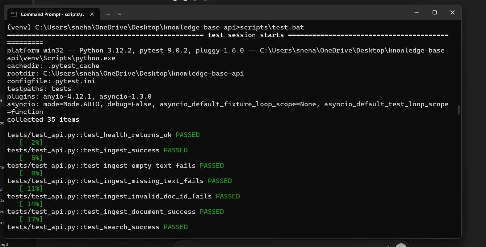
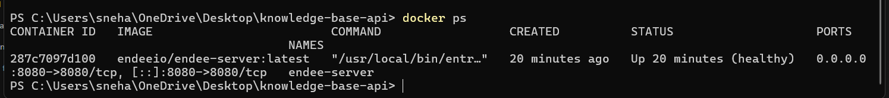
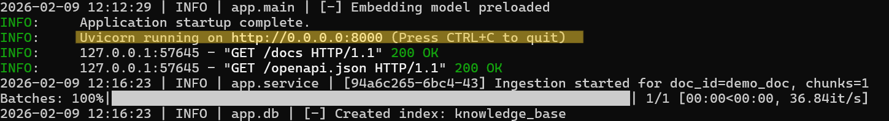
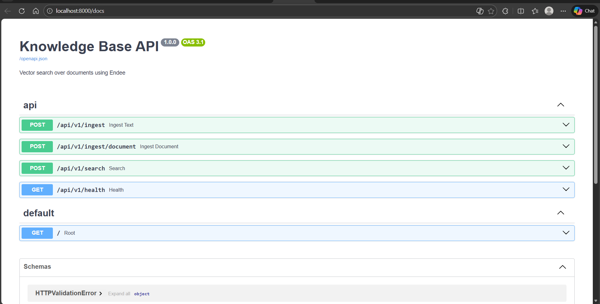
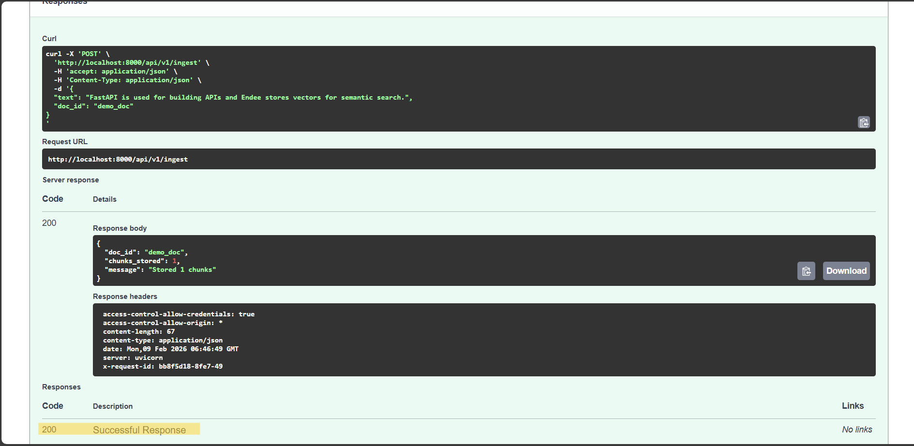
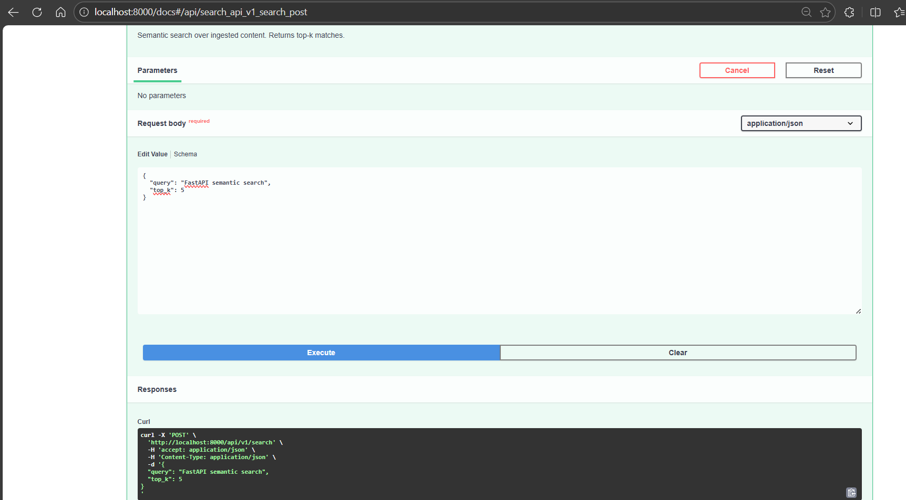
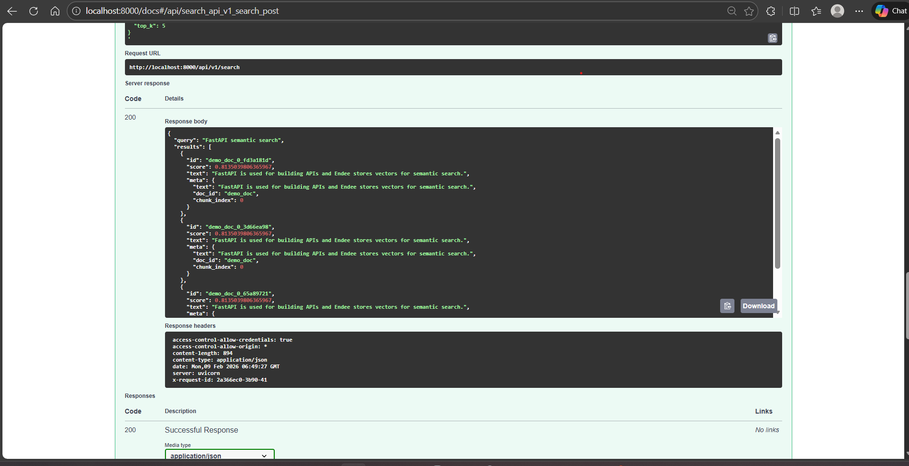
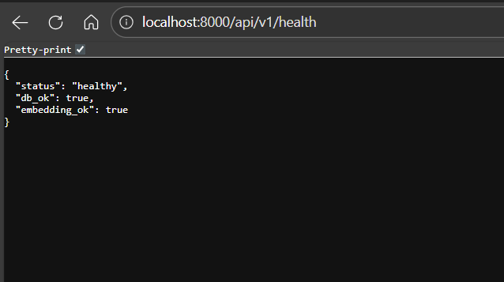

# Knowledge Base API

A production-style semantic search application using **Endee** as the vector database. It provides semantic search over documents: ingest text, create embeddings, store in Endee, and retrieve top-k matches by similarity.

---

## For Evaluators: How to Run

**Prerequisites:** Python 3.10+ (that's it — no Docker, no API token)

### Quick verify (~1 min)

1. Clone and enter:
   ```bash
   git clone https://github.com/snehaaojha/knowledge-base-api.git
   cd knowledge-base-api

   ```
## Screenshots / Proof

### 1) Tests


### 2) Endee running in Docker


### 3) API Running (Uvicorn)


### 4) Swagger Docs


### 5) Ingest Success


### 6) Search Success





### 7) Health OK


2. Setup and run tests:
   ```bash
   # Windows
   scripts\setup-eval.bat
   scripts\test.bat

   # Linux / Mac
   bash scripts/setup-eval.sh
   bash scripts/test.sh
   ```

   You should see `34 passed` (or more). Done.

---

### Full API (ingest + search)

**Prerequisites:** Docker, Python 3.10+

1. **Clone and setup**
   ```bash
   git clone https://github.com/snehaaojha/knowledge-base-api.git
   cd knowledge-base-api
   scripts\setup.bat          # Windows
   bash scripts/setup.sh      # Linux/Mac
   ```

2. **Start Endee** — pick one:
   - `docker run -d -p 8080:8080 -v endee-data:/data --name endee-server endeeio/endee-server:latest`
   - Or `scripts\docker-run.bat` / `bash scripts/docker-run.sh` (starts Endee + API)

3. **Start the API** (if not using docker-run)
   ```bash
   scripts\run.bat            # Windows
   bash scripts/run.sh        # Linux/Mac
   ```

4. **Try it:** http://localhost:8000/docs

---

## Project Structure

```
sneha/
├── app/              # Application code
│   ├── main.py       # FastAPI app, CORS, logging, exception handlers
│   ├── api.py        # HTTP endpoints (ingest, search, health)
│   ├── service.py    # Business logic, chunking, orchestration
│   ├── db.py         # Endee vector DB, timeouts
│   ├── embeddings.py # Embedding generation
│   ├── schemas.py    # Pydantic models
│   ├── config.py     # Environment config
│   ├── middleware.py # Request ID propagation
│   ├── exceptions.py # ServiceError, EmbeddingError, VectorStoreTimeoutError
│   └── constants.py  # MAX_CHUNK_CHARS, limits
├── scripts/          # setup, run, test, docker, start-endee-from-fork
├── tests/            # test_api, test_service, test_main, test_middleware, test_integration
├── CONTRIBUTING.md   # Setup and test instructions
├── requirements.txt
├── Dockerfile
├── docker-compose.yml
└── .env.example
```

---

## Endee Setup (Criterion 2: Fork & Use)

This project uses [Endee](https://github.com/EndeeLabs/endee) as the vector database. **Fork used:** [snehaaojha/endee_t1](https://github.com/snehaaojha/endee_t1).

### Option A — Run Endee from your fork (builds from source)

```bash
# Windows
scripts\start-endee-from-fork.bat

# Linux/Mac
chmod +x scripts/start-endee-from-fork.sh
./scripts/start-endee-from-fork.sh
```

This clones your fork, builds the Endee image, and runs it on port 8080. Requires Docker and Git.

### Option B — Pre-built image (quickest)

```bash
docker run -d -p 8080:8080 -v endee-data:/data --name endee-server endeeio/endee-server:latest
```

### Option C — Docker Compose (Endee + API together)

```bash
scripts\docker-run.bat   # Windows
./scripts/docker-run.sh  # Linux/Mac
```

### Connect this app to Endee

In `.env`:
```
ENDEE_BASE_URL=http://localhost:8080/api/v1
ENDEE_TOKEN=
```

Then start the API: `scripts\run.bat` or `./scripts/run.sh`

---

## Problem Statement

Organizations need to search large document collections by *meaning*, not just keywords. Traditional keyword search fails when users describe concepts in different words. This system solves that by:

1. Converting text into dense vector embeddings (semantic representation)
2. Storing embeddings in a vector database (Endee) for fast similarity search
3. Exposing a simple API to ingest documents and query by natural language

---

## System Overview

- **Vector search at the core**: All search is semantic—queries and documents are embedded, and similarity is computed in vector space.
- **Tech stack**: Python, FastAPI, Endee, sentence-transformers, Pydantic, Docker.
- **Use case**: Knowledge base search, document retrieval, or a simple RAG (Retrieval-Augmented Generation) assistant.

---

## Architecture

```
┌─────────────┐     ┌──────────┐     ┌─────────────┐     ┌───────┐
│   Client    │────▶│   API    │────▶│   Service   │────▶│  DB   │
│  (HTTP)     │     │ (FastAPI)│     │  (logic)    │     │(Endee)│
└─────────────┘     └──────────┘     └──────┬──────┘     └───────┘
                            │               │
                            │               ▼
                            │        ┌─────────────┐
                            │        │ Embeddings  │
                            │        │ (sentence-  │
                            │        │ transformers)│
                            │        └─────────────┘
                            ▼
                     ┌─────────────┐
                     │  Schemas    │
                     │ (Pydantic)  │
                     └─────────────┘
```

**Module responsibilities:**

| Module        | Responsibility                                                |
|---------------|---------------------------------------------------------------|
| `main.py`     | App startup, CORS, logging, validation/exception handlers     |
| `api.py`      | HTTP routes (ingest, search, health); 504 on timeout          |
| `service.py`  | Chunking, orchestration of ingest and search                  |
| `embeddings.py` | Embedding generation (sentence-transformers)                |
| `db.py`       | Endee index creation, upsert, query, timeouts                 |
| `schemas.py`  | Request/response Pydantic models                              |
| `middleware.py` | Request ID from header or generated; propagates to response |
| `exceptions.py` | ServiceError, EmbeddingError, VectorStoreTimeoutError       |
| `constants.py`  | MAX_CHUNK_CHARS, META_SANITIZE_MAX_DEPTH                      |

---

## How Ingestion Works

1. Client sends text (or document content) via `POST /api/v1/ingest` or `POST /api/v1/ingest/document`.
2. **Validation**: Pydantic ensures non-empty input; empty input returns `422`.
3. **Chunking**: Text is split into sentence-aware chunks (max 512 chars) to fit embedding model limits.
4. **Embedding**: Each chunk is embedded using `all-MiniLM-L6-v2` (384 dimensions).
5. **Storage**: Chunks and metadata (text, doc_id, chunk_index) are upserted into Endee.
6. Response returns `doc_id` and `chunks_stored`.

---

## How Search Works

1. Client sends a query via `POST /api/v1/search` with `query` and optional `top_k`.
2. **Validation**: Query must be non-empty; `top_k` must be between 1 and 50.
3. **Embedding**: Query text is embedded with the same model.
4. **Retrieval**: Endee returns the top-k nearest vectors (cosine similarity).
5. **Response**: Results include `id`, `score`, `text`, and `meta` for each match.

---

## Error Handling

| Scenario            | HTTP Status | Behavior                                      |
|---------------------|-------------|-----------------------------------------------|
| Empty text/query    | 422         | Validation error with clear message           |
| Invalid format      | 422         | Pydantic validation details in response       |
| Text/query too long | 422         | text/content max 1M chars, query max 10k      |
| DB connection fail  | 500         | Generic "Ingestion failed" / "Search failed"  |
| Embedding failure   | 500         | Generic message; full error logged server-side|
| Endee timeout       | 504         | "Vector store request timed out"              |
| Health check        | 200         | Returns `degraded` if DB or embedding fails   |

Errors are logged with structured logging; clients receive generic messages only.

---

## Why a Vector Database?

- **Semantic search**: Embeddings capture meaning; similar concepts cluster in vector space.
- **Scale**: Endee uses HNSW for fast approximate nearest-neighbor search at scale.
- **Filtering**: Endee supports metadata filters for hybrid semantic + structured queries.
- **Separation of concerns**: Vector DB handles indexing and search; the app handles orchestration and APIs.

---

## Example Requests

**Ingest:**
```bash
curl -X POST http://localhost:8000/api/v1/ingest \
  -H "Content-Type: application/json" \
  -d '{"text": "Python is a programming language. It is used for web development and data science."}'
```

**Search:**
```bash
curl -X POST http://localhost:8000/api/v1/search \
  -H "Content-Type: application/json" \
  -d '{"query": "What is Python used for?", "top_k": 5}'
```

**Health:**
```bash
curl http://localhost:8000/api/v1/health
```

See **For Evaluators** and **Full API** sections above for setup. For manual setup: `scripts\setup.bat` or `scripts/setup.sh`, then `scripts\run.bat` or `./scripts/run.sh`. API: http://localhost:8000, Docs: http://localhost:8000/docs.

### Run Tests

```bash
scripts\test.bat    # Windows
./scripts/test.sh   # Linux/Mac
# or: python -m pytest -v
```

No Endee token required — tests mock external dependencies.

### Run with Docker

```bash
scripts\docker-run.bat   # Windows
./scripts/docker-run.sh  # Linux/Mac
# or: docker-compose up --build
```

Docker Compose starts **Endee** (port 8080) and the **API** (port 8000) together. No `ENDEE_TOKEN` needed for local Endee; the API connects to `http://endee:8080/api/v1`.

---

## Design Choices

### Sentence-aware chunking

Text is chunked on sentence boundaries (via `re.split` on `. `, `? `, `! `) rather than at fixed character offsets. This keeps chunks semantically coherent: a chunk tends to be one or more complete thoughts, which improves embedding quality and retrieval relevance.

### Chunk size: 512 characters

- **all-MiniLM-L6-v2** has a 512-token limit; character-based 512 is a safe upper bound for typical English text (~1–2 tokens per word).
- Smaller chunks improve precision; larger chunks add context but risk mixing topics. 512 chars balances both.

### Cosine similarity

Endee returns nearest neighbors by **cosine similarity**, which measures angle between vectors. It is scale-invariant, so it works well with normalized embeddings. Alternatives (e.g. Euclidean distance) would be sensitive to embedding magnitude; cosine is the standard for semantic search with unit-normalized vectors.

---

## Limits & Rationale

| Limit | Value | Rationale |
|-------|-------|-----------|
| Ingest text | 1M chars | Typical documents; prevents memory exhaustion |
| Search query | 10k chars | Long queries rare; keeps embedding cost bounded |
| top_k | 1–50 | Balance between relevance and response size |
| doc_id | 256 chars | Enough for UUIDs and human-readable IDs |

---

## Configuration

| Variable                | Description                          | Default       |
|-------------------------|--------------------------------------|---------------|
| `ENDEE_TOKEN`           | Endee API token                      | (empty)       |
| `ENDEE_BASE_URL`        | Custom Endee API URL                 | (cloud URL)   |
| `ENDEE_TIMEOUT_SECONDS` | Timeout for Endee HTTP calls         | 30            |
| `APP_ENV`        | Environment (development/prod) | development                 |
| `LOG_LEVEL`      | Logging level                  | INFO                        |
| `index_name`     | Endee index name               | knowledge_base              |
| `chunk_size`     | Chunk size (chars)             | 512                         |
| `default_top_k`  | Default search results         | 5                           |

---

## Development

See [CONTRIBUTING.md](CONTRIBUTING.md) for setup steps and how to run tests.

- **Request flow**: API → Service (chunking/orchestration) → DB + Embeddings
- **Request ID**: Each request gets an `X-Request-ID` (from header or generated); included in logs and response headers for correlation
- **Tests**: `conftest.py` provides `client` fixture; API tests mock Endee and embeddings
- **Validation**: Pydantic schemas in `schemas.py`; 500 responses use generic messages (no internal details)

---

## Troubleshooting

| Issue | Solution |
|-------|----------|
| Tests fail with import errors | Ensure you're in the project root; run `scripts/setup-eval.bat` or `scripts/setup-eval.sh` |
| API won't start: "Address already in use" | Port 8000 is in use; stop other processes or change port: `uvicorn app.main:app --port 8001` |
| Health returns `degraded` | Endee not reachable; ensure Docker container is running and `ENDEE_BASE_URL` in `.env` matches |
| Embedding model loads slowly | First request may take 30+ seconds; use lifespan preload (default) so health checks stay fast |
| 504 Gateway Timeout on ingest/search | Endee is slow or unreachable; increase `ENDEE_TIMEOUT_SECONDS` or check network |

---

## Future Improvements

- **File upload**: Accept PDF/DOCX, extract text, then ingest.
- **RAG assistant**: Add a generation step to produce answers from retrieved chunks.
- **Batch ingestion**: Async jobs for large document sets.
- **Authentication**: API keys or OAuth for production.
- **Hybrid search**: Use Endee’s sparse vectors (BM25) alongside dense embeddings.
- **Pagination**: Offset or keyset pagination for large result sets.

---

## License

MIT.
